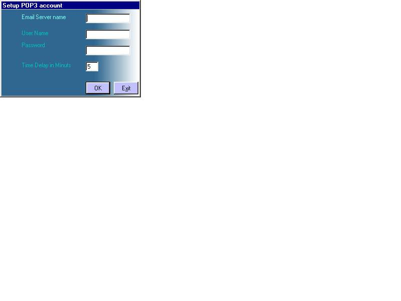



## EMail Checker Updated

### Description

so here is the email checking utility. i got some of the code from planet-source-code.com.

the purpose of this utility is to sit in the System tray and start checking mails after a certain period of time. it is really cool.

hope you get advantage from it.

please send me feed back if you like it.
 
### More Info
 

             |
---                |---
**Submitted On**   |2000-10-23 17:51:02
**By**             |[BrainSoft Technologies, Inc\.](https://github.com/Planet-Source-Code/PSCIndex/blob/master/ByAuthor/brainsoft-technologies-inc.md)
**Level**          |Intermediate
**User Rating**    |3.8 (15 globes from 4 users)
**Compatibility**  |VB 5\.0, VB 6\.0
**Category**       |[Complete Applications](https://github.com/Planet-Source-Code/PSCIndex/blob/master/ByCategory/complete-applications__1-27.md)
**World**          |[Visual Basic](https://github.com/Planet-Source-Code/PSCIndex/blob/master/ByWorld/visual-basic.md)
**Archive File**   |[CODE\_UPLOAD1078310192000\.zip](https://github.com/Planet-Source-Code/brainsoft-technologies-inc-email-checker-updated__1-12153/archive/master.zip)

